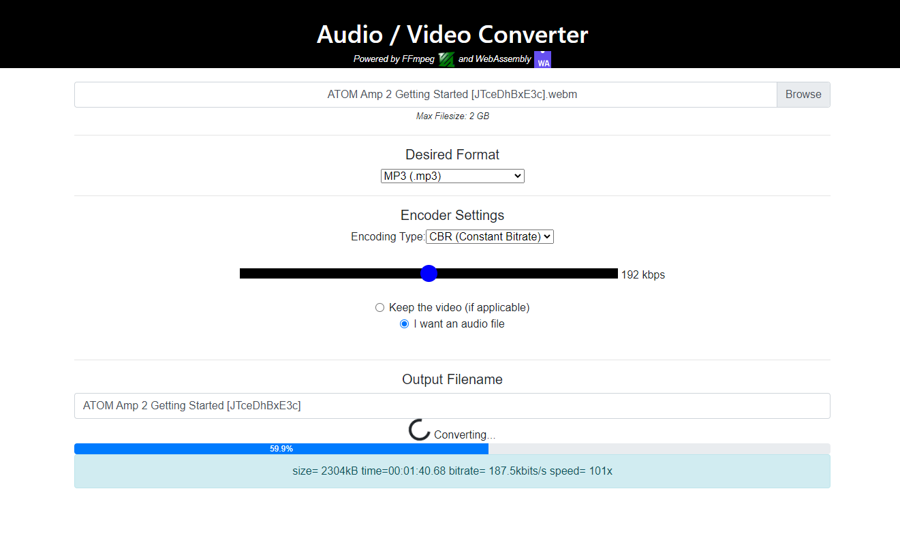
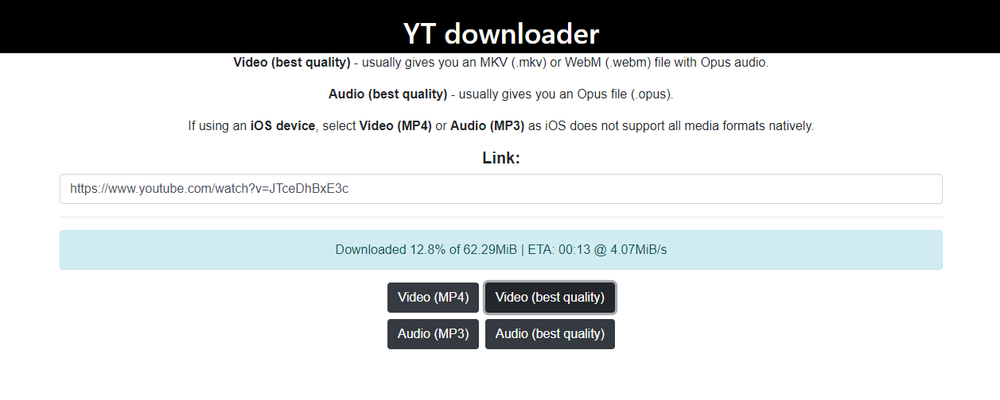

<div align="center">
  
  
  
  
  
  
  
  
</div>

## Converter
Convert an audio or video file to any of the following formats:

- AAC
- AC3 (Dolby Digital)
- ALAC
- DTS
- FLAC
- MP3
- Opus
- Vorbis
- WAV

Converting a video to one of the above formats will turn it into an audio-only file. You can also convert a video to MP4 or MKV.

## YouTube Downloader
Visit the `/yt` endpoint to use the YouTube downloader, which is essentially a frontend for [yt-dlp](https://github.com/yt-dlp/yt-dlp). There are four options:

- **Video (MP4)** - downloads the best quality MP4 video stream and merges it with the best quality AAC audio stream. If no MP4 stream is available, this option will behave the same as **Video (best quality)**.
- **Video (best quality)** - downloads the best format (determined by yt-dlp) that contains video. If this format doesn't contain an audio stream, it is merged with the best quality audio stream. This option usually results in a video file in the WebM format with Opus audio.
- **Audio (best quality)** - downloads the best quality audio stream. Usually an Opus file with bitrate of ~160 kbps.
- **Audio (MP3)** - downloads the best quality audio stream and converts it to the MP3 format.

_If you are not sure which option to opt for, I recommend **Video (MP4)** and **Audio (MP3)** depending on whether you want the video or an audio-only file. This is because MP3 and MP4 files are more widely supported compared to Opus and WebM files._

## Docker
You can run this web app locally with a single command:

- ```
  cd docker/dev && docker compose up --build --watch
  ```

  Or if using PowerShell:

  ```powershell
  Set-Location docker/dev; if ($?) { docker compose up --build --watch }
  ```

- Visit http://localhost:3001

_Any changes you make in `/backend/src` or `/frontend/src` will be reflected without having to rebuild any containers. Simply refresh your web browser._
