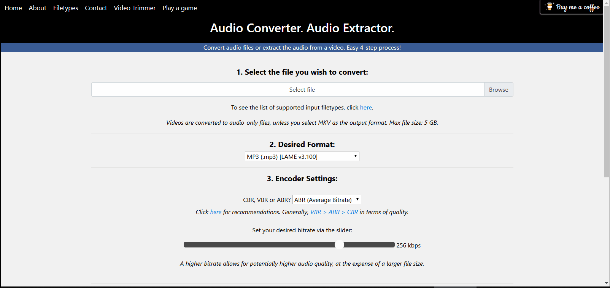

## Demo

## About
On https://freeaudioconverter.net, you can:
- Convert an audio file to another format - MP3, AAC, WAV, FLAC, ALAC, CAF, Opus, Vorbis, AC3, DTS or Speex.
- Convert a video to an audio-only file (to any of the above formats).
- Trim a video or audio file [https://freeaudioconverter.net/file-trimmer]
- Convert a video to the MKV format (well, container).
## How does it work?
- Your file is uploaded to a server, where the conversion/file trimming takes place. On completion, the file is sent to your browser and is automatically downloaded.
## Features
- You can see the file upload progress as a percentage and also amount uploaded (MB) in realtime.
- Upload completion time is shown in realtime.
- Whilst the file is being converted, you can see how far into the file the encoder currently is. This information is updated every second.
## Supported filetypes
Many filetypes are supported, click [here](https://freeaudioconverter.net/filetypes) for details. Support for other filetypes may be added, feel free to [contact me](https://freeaudioconverter.net/contact) to enquire. 
## To-do
The file trimmer will not work when using the Safari browser as it does not support the HTML <input type="time">
I may try to find another user-friendly way to allow the user to input their desired start and end time that is compatible with all browsers. Feel free to submit a pull request if you know of a good alternative implementation that is compatible with all browsers.
## Technologies and encoders used:
[Flask](https://github.com/pallets/flask) - a micro framework for building web applications with Python.

[FFmpeg](https://github.com/FFmpeg/FFmpeg)

LAME v3.100 | https://lame.sourceforge.io/

fdkaac (https://github.com/nu774/fdkaac) which is a command line encoder frontend for fdk-aac (https://github.com/mstorsjo/fdk-aac).

libopus 1.3.1 | https://github.com/xiph/opus

libvorbis 1.3.6 | https://github.com/xiph/vorbis
## Contributing
I'm open to contributors, especially those who are familiar with video encoding with FFmpeg because a consideration that I have is adding the ability to transcode a video (under a new Flask route (/video-encoder)) to expand on what users can do on the website. Feel free to contact me using the [contact](https://freeaudioconverter.net/contact) section of the website if you have any questions.
## License
Custom - see the [LICENSE](https://github.com/BassThatHertz/freeaudioconverter.net/blob/master/LICENSE) file for details.
